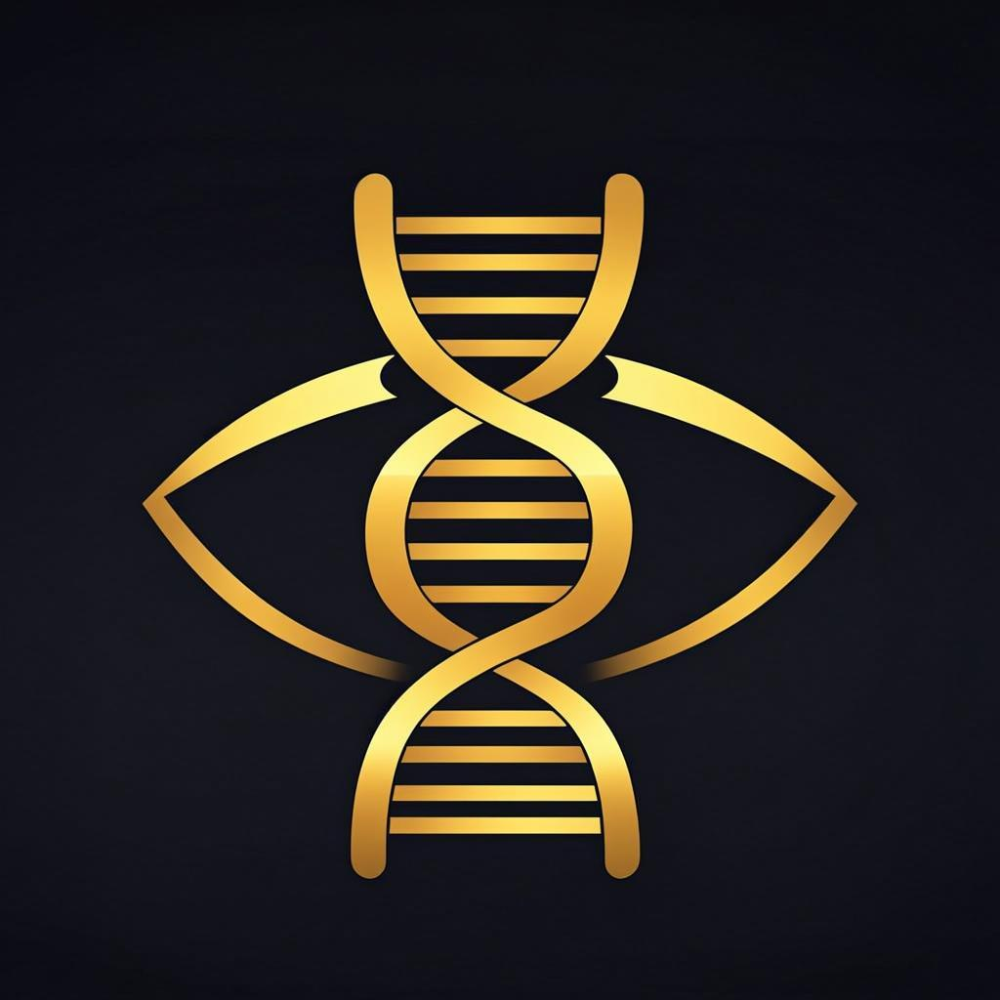

<div align="center">



# 审美自进化 · Aesthetic Self-Evolution

**域感知的审美智能进化系统 | Domain-Aware Aesthetic Intelligence Evolution System**

[](https://opensource.org/licenses/MIT)
[](https://nextjs.org/)
[](https://www.typescriptlang.org/)
[](https://www.prisma.io/)


[English](#-english) · [中文](#-中文)

</div>

---

## 🇨🇳 中文

### 💡 项目愿景

AI 能生成图片、界面、游戏场景，但**它不知道什么是"美"**。现有的审美评估模型用一套标准评判所有内容，忽略了根本问题：**不同领域的审美逻辑完全不同**。

本项目基于三大权威理论，构建**域感知的审美评估与自进化智能系统**：

| 理论基础 | 核心贡献 | 来源 |
|---------|---------|------|
| 🏛️ 自由美 vs 依附美 | 审美判断不是统一的——依附于领域概念的"美"与纯粹形式的美判断结构根本不同 | Kant, *Critique of Judgment* (1790) |
| 🧠 审美三重模型 | 大脑同时存在域通用和域特异的审美响应——FFA 对面孔美特异性反应，但对建筑美没有 | Chatterjee, MIT Open Encyclopedia of Cognitive Science (2024) |
| 🔄 信息加工模型 | 审美体验必须先做"外显分类"（识别对象类型），才能做出审美判断 | Leder et al., *British Journal of Psychology* (2004) |
| 📊 主题感知网络 | 实验证明：忽略主题差异的通用模型被主题感知模型全面碾压 | He et al., IJCAI (2022) |

### 🎯 核心创新

**1. 审美域分割（Aesthetic Domain Segmentation）**

按"知识-意义系统是否同构"划分 6 大审美家族，而非按表面内容分类：

| 审美家族 | 包含领域 | 评估维度 |
|---------|---------|---------|
| 🎬 叙事视觉 | 影视摄影、游戏过场、动画分镜 | 构图 · 光影 · 色调 · 叙事张力 · 节奏感 |
| 🖥️ 交互界面 | UI设计、游戏HUD、Web/App | 视觉层次 · 间距节奏 · 色彩体系 · 字体排版 · 可用性之美 |
| 🏛️ 空间营造 | 游戏场景、建筑可视化、VR | 空间比例 · 氛围渲染 · 纵深层次 · 沉浸感 · 细节丰富度 |
| 👤 人物造型 | 角色设计、服装设计、数字人 | 比例 · 轮廓线 · 材质表现 · 风格化 · 表现力 |
| 🎨 平面构成 | 海报设计、品牌视觉、插画 | 排版 · 负空间 · 色彩和谐 · 视觉重心 · 构成完整 |
| ⚡ 动态韵律 | 动效设计、特效动画、舞蹈编排 | 节奏 · 过感 · 能量流动 · 律动感 · 冲击力 |

**2. 审美自进化闭环（Aesthetic Evolution Loop）**

```
感知 (Perceive) → 判断 (Judge) → 反思 (Reflect) → 进化 (Evolve) → 记忆 (Memory)
     ↑                                                              │
     └──────────────────── 新数据/反馈 ◀────────────────────────────┘
```

- **感知**：VLM 多模态理解图像内容
- **判断**：基于家族专属维度进行结构化审美评估
- **反思**：分析高分 vs 低分作品的模式差异
- **进化**：生成/修改/废弃审美法则
- **记忆**：审美法则库持续积累和迭代

**3. 跨家族迁移协议（Cross-Family Transfer Protocol）**

不是直接共享审美标准，而是**验证式迁移**：
- 家族 A 进化出一条审美法则
- 在家族 B 的数据上**验证**该法则是否成立
- 成立 → 迁移成功（以候选身份，低初始置信度）
- 不成立 → 标记为域特有，不迁移

### 🏗️ 系统架构

```
┌─────────────────────────────────────────────────────┐
│  Layer 0: 通用审美底层 (Universal Aesthetic Base)    │
│  色彩和谐 · 对称/平衡 · 对比度 · 视觉清晰度          │
│  对应 Kant "自由美" / Chatterjee 感觉运动系统        │
├─────────────────────────────────────────────────────┤
│  Layer 1: 审美家族 (Aesthetic Families)              │
│  按知识-意义系统异构划分 · 每家族独立进化循环          │
│  对应 Kant "依附美" / Chatterjee 知识-意义系统       │
├─────────────────────────────────────────────────────┤
│  Layer 2: 域内主题 (Intra-domain Themes)             │
│  同家族内的风格细分 · 条件分支处理，不独立进化          │
│  对应 TANet TAD66K 的 47 主题粒度                     │
└─────────────────────────────────────────────────────┘
```

### 🛠️ 技术栈

- **框架**: Next.js 16 (App Router) + TypeScript 5
- **AI 引擎**: z-ai-web-dev-sdk (VLM: qwen2.5-vl-72b-instruct)
- **数据库**: Prisma ORM + SQLite
- **UI**: Tailwind CSS 4 + shadcn/ui + Framer Motion
- **图表**: Recharts

### 🚀 快速开始

```bash
# 克隆项目
git clone https://github.com/wangbei439/aesthetic-self-evolution.git
cd aesthetic-self-evolution

# 安装依赖
bun install

# 配置环境变量
cp .env.example .env
# 编辑 .env 填入你的 DATABASE_URL 和 AI API 密钥

# 初始化数据库
bun run db:push

# 启动开发服务器
bun run dev
```

打开 http://localhost:3000 即可使用。

### 📁 项目结构

```
src/
├── app/
│   ├── api/
│   │   ├── families/route.ts      # 6大审美家族数据
│   │   ├── evaluate/route.ts      # VLM驱动的域感知审美评估
│   │   ├── evolution/route.ts     # 进化统计 + 触发进化循环
│   │   └── evaluations/route.ts   # 评估历史查询
│   ├── page.tsx                   # 主页面
│   └── globals.css
├── components/
│   ├── hero-section.tsx           # 首屏展示
│   ├── families-section.tsx       # 6大家族卡片
│   ├── evaluator-section.tsx      # 审美评估器
│   ├── evolution-dashboard.tsx    # 进化仪表盘
│   ├── architecture-section.tsx   # 架构说明
│   └── footer.tsx
├── lib/
│   ├── db.ts                      # Prisma 客户端
│   └── utils.ts                   # 工具函数
prisma/
└── schema.prisma                  # 数据库 Schema
```

### 🤝 贡献

欢迎各种形式的贡献！

1. Fork 本仓库
2. 创建功能分支 (`git checkout -b feature/amazing-feature`)
3. 提交更改 (`git commit -m 'Add amazing feature'`)
4. 推送到分支 (`git push origin feature/amazing-feature`)
5. 发起 Pull Request

### 📄 许可证

本项目基于 [MIT License](LICENSE) 开源。

---

## 🇬🇧 English

### 💡 Vision

AI can generate images, interfaces, and game scenes, but **it doesn't know what "beauty" is**. Existing aesthetic evaluation models judge all content with a single set of criteria, ignoring a fundamental truth: **aesthetic judgment logic differs fundamentally across domains**.

This project builds a **domain-aware aesthetic evaluation and self-evolving intelligence system** based on three authoritative theories:

| Theoretical Basis | Core Contribution | Source |
|-------------------|-------------------|--------|
| 🏛️ Free vs. Dependent Beauty | Aesthetic judgments are NOT unified — beauty dependent on domain concepts has fundamentally different judgment structures from pure formal beauty | Kant, *Critique of Judgment* (1790) |
| 🧠 Aesthetic Triad | The brain harbors both domain-general AND domain-specific aesthetic responses — the FFA responds specifically to facial beauty but not architectural beauty | Chatterjee, MIT Open Encyclopedia of Cognitive Science (2024) |
| 🔄 Information Processing Model | Aesthetic experience requires "explicit classification" (identifying object type) before aesthetic judgment can occur | Leder et al., *British Journal of Psychology* (2004) |
| 📊 Theme-Aware Network | Empirically proven: theme-aware models comprehensively outperform generic models that ignore domain differences | He et al., IJCAI (2022) |

### 🎯 Core Innovations

**1. Aesthetic Domain Segmentation**

6 aesthetic families segmented by "whether knowledge-meaning systems are isomorphic", not by surface content:

| Aesthetic Family | Included Domains | Evaluation Dimensions |
|-----------------|-----------------|----------------------|
| 🎬 Narrative Visual | Film, game cutscenes, animation storyboards | Composition · Light & Shadow · Color Tone · Narrative Tension · Rhythm |
| 🖥️ Interactive UI | UI design, game HUDs, web/app interfaces | Visual Hierarchy · Spacing Rhythm · Color System · Typography · Usability Beauty |
| 🏛️ Spatial | Game scenes, architectural visualization, VR | Spatial Proportion · Atmosphere · Depth Layering · Immersion · Detail Richness |
| 👤 Character | Character design, fashion, digital humans | Proportion · Silhouette · Material Rendering · Styling · Expression |
| 🎨 Graphic Composition | Posters, branding, illustration | Layout · Negative Space · Color Harmony · Visual Weight · Completeness |
| ⚡ Dynamic Rhythm | Motion design, VFX, dance choreography | Tempo · Transition · Energy Flow · Musicality · Impact |

**2. Aesthetic Evolution Loop**

```
Perceive → Judge → Reflect → Evolve → Memory
     ↑                                   │
     └───────── New Data/Feedback ◀──────┘
```

**3. Cross-Family Transfer Protocol**

Verification-based transfer — not direct sharing:
- Family A evolves an aesthetic rule
- Validate whether the rule holds on Family B's data
- Valid → Transfer as "candidate" (low initial confidence)
- Invalid → Mark as domain-specific, no transfer

### 🏗️ Architecture

```
Layer 0: Universal Aesthetic Base (Kant's Free Beauty / Chatterjee's Sensorimotor)
    ↓
Layer 1: Aesthetic Families (Kant's Dependent Beauty / Chatterjee's Knowledge-Meaning)
    ↓
Layer 2: Intra-domain Themes (TANet TAD66K granularity)
```

### 🛠️ Tech Stack

- **Framework**: Next.js 16 (App Router) + TypeScript 5
- **AI Engine**: z-ai-web-dev-sdk (VLM: qwen2.5-vl-72b-instruct)
- **Database**: Prisma ORM + SQLite
- **UI**: Tailwind CSS 4 + shadcn/ui + Framer Motion
- **Charts**: Recharts

### 🚀 Quick Start

```bash
git clone https://github.com/wangbei439/aesthetic-self-evolution.git
cd aesthetic-self-evolution
bun install
cp .env.example .env  # Edit with your API keys
bun run db:push
bun run dev
```

Visit http://localhost:3000 to start evaluating.

### 🤝 Contributing

1. Fork the repo
2. Create feature branch (`git checkout -b feature/amazing-feature`)
3. Commit changes (`git commit -m 'Add amazing feature'`)
4. Push to branch (`git push origin feature/amazing-feature`)
5. Open a Pull Request

### 📄 License

This project is licensed under the [MIT License](LICENSE).

---

<div align="center">

**如果这个项目对你有帮助，请给一个 ⭐ Star！**

**If this project helps you, please give it a ⭐ Star!**

</div>
